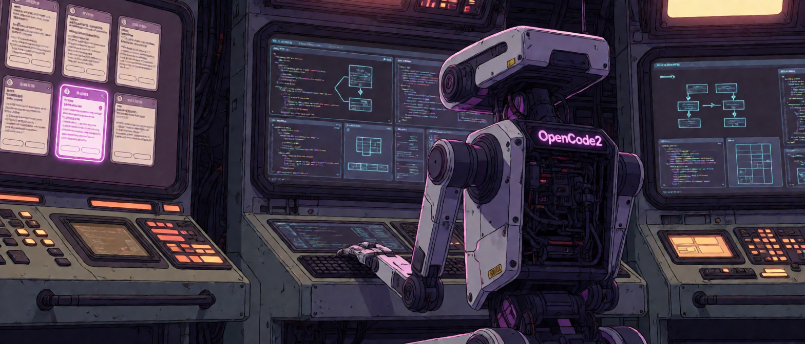

# OpenCode 2 GitHub Automation



A scheduler and GitHub dispatcher in one package, built for **OpenCode 2**.

`@opencodebot` in an issue → acknowledgement → questions if needed → implementation → tests → PR.

The bot waits for answers in the issue, handles follow-up comments, chooses PR
titles, and can merge after an authorized approval. The TUI is optional.

## Requirements

- OpenCode **2.0.6** with a working model; client/plugin SDK pinned to `2.0.6`.
- Node.js 22+, npm, and Git on macOS/Linux.
- GitHub authentication (`gh auth login` and `gh auth setup-git`, or a token in
  the service environment) and permission to comment, push, and create PRs.
- When configuring a project: a primary Git checkout with a GitHub `origin`,
  a pushed commit, and issues enabled.

Choose **one** installation method below. No target repository is needed yet.
Nothing needs to be published to npm. `$HOME` expands to your home directory.

## Install from a .tgz package

Run this command on the machine running OpenCode 2:

<!-- latest-release:start -->
Latest stable release: **[v0.6.5](https://github.com/d3cker/opencode2-github-automation/releases/tag/v0.6.5)**.

[Download the .tgz package](https://github.com/d3cker/opencode2-github-automation/releases/download/v0.6.5/opencode2-automation-0.6.5.tgz) · [SHA-256 checksum](https://github.com/d3cker/opencode2-github-automation/releases/download/v0.6.5/opencode2-automation-0.6.5.tgz.sha256)

```bash
npm install --global --prefix "$HOME/.local" "https://github.com/d3cker/opencode2-github-automation/releases/download/v0.6.5/opencode2-automation-0.6.5.tgz"
```
<!-- latest-release:end -->

`postinstall` registers both the plugin and TUI automatically. No `sudo`,
source checkout, or manual config editing is needed. Do not add
`--ignore-scripts`; npm needs network access to install dependencies.
You can also download the archive and pass its local path to the same command.

Restart the service when its sessions are idle:

```bash
opencode2 service restart
```

The CLI is now at `$HOME/.local/bin/opencode2-automation`. If `$HOME/.local/bin`
is on your PATH, you can use the shorter `opencode2-automation` command.
Configure a project below when ready.

## Install from source

1. Clone and build:

   ```bash
   git clone https://github.com/d3cker/opencode2-github-automation.git "$HOME/opencode2-github-automation"
   cd "$HOME/opencode2-github-automation"
   npm ci && npm run build
   ```

2. Register the plugin and TUI:

   ```bash
   node "$HOME/opencode2-github-automation/dist/setup.js" install
   ```

3. Restart the idle service:

   ```bash
   opencode2 service restart
   ```

Keep the source directory: OpenCode loads its compiled code. `npm ci` in a
source checkout does not register a global plugin automatically.
Both installers reuse recognized older loaders and refuse to overwrite custom
code. Registration defaults to `~/.config/opencode/plugins/opencode-automation/`
and respects `XDG_CONFIG_HOME` and `OPENCODE_CONFIG_DIR`.

## Configure a project

1. Enter your target repository and run the wizard:

   ```bash
   cd /absolute/path/to/your-project
   "$HOME/.local/bin/opencode2-automation" init
   ```

   **Source installation:** use
   `node "$HOME/opencode2-github-automation/dist/setup.js" init` instead.

2. Answer the prompts. Enter accepts the value in brackets. The wizard asks
   about the model and capabilities, a vision helper if needed, base branch,
   trigger, signature, allowed authors, polling, auto-merge, and tests.
   Use `provider/model` for model IDs and `skip` to skip automated tests.

3. Load the project with the [headless command below](#run-without-the-tui), or
   open it with `opencode2 /absolute/path/to/your-project`.

Settings are saved to `/absolute/path/to/your-project/.opencode/automation.json`.
If it already exists, edit it directly and skip `init`. Repeat setup for each
repository; the plugin is installed only once. After editing settings, restart
the idle service and reload the project.

Create an issue containing `@opencodebot` (or your configured trigger). The bot
checks every 60 seconds by default and may also pick up existing matching issues.
Only the authenticated GitHub user is allowed by default; add colleagues to
`authors` in the JSON to let them request work.

## Run without the TUI

Run once for **each configured primary checkout**, with its absolute path:

```bash
opencode2 api plugin.list --param 'location[directory]=/absolute/path/to/your-project'
```

This starts the shared service if needed and loads the project's plugins. The
response lists the loaded plugins; confirm `automation` has `state.status` equal
to `active`. The command exits; the bot keeps running without a TUI or extra monitoring process.
**Repeat it after every service restart.**

OpenCode 2.0.6 uses operation names without the `v2.` prefix and no longer exposes
`plugin.awaitActivation`. Upgrade the automation package together with OpenCode;
older beta SDKs cannot discover its service correctly. See
[upgrade compatibility](docs/installation.md#opencode-206-compatibility).

For automatic startup after a machine reboot, put one invocation per project in
your operating system's startup mechanism, under the same user, after networking
is available. Use absolute executable/repository paths (`command -v opencode2`
finds the executable) and provide the usual PATH and GitHub authentication.
A reboot-only task does not handle later `opencode2 service restart` calls.

## Update from a .tgz package

Wait for active bot work to finish, then:

1. Run the versioned command in [Install from a .tgz package](#install-from-a-tgz-package)
   using the **same prefix** as before. After publication, the README on `release`
   links to the new stable package; `main` receives that link through the promotion PR.

   `postinstall` refreshes registration;
   project settings and queues are preserved. Do not run `init` again.

2. Reload the service:

   ```bash
   opencode2 service restart
   ```

3. Run the [headless command](#run-without-the-tui) for each project, or open each
   in the TUI. Reopen existing TUI clients when the update changes the UI.

Switching from a source installation to `.tgz` uses the same procedure; recognized
source loaders are repointed to the installed package instead of duplicated.

## Update from source

Wait for active bot work to finish, then:

1. Download changes for your current branch:

   ```bash
   cd "$HOME/opencode2-github-automation"
   git pull --ff-only
   ```

2. Rebuild:

   ```bash
   npm ci && npm run build
   ```

3. Restart and [reload each project](#run-without-the-tui):

   ```bash
   opencode2 service restart
   ```

Settings and queues remain in place. Do not run `init` again. If switching back
from `.tgz` to source, also run the source `install` command after rebuilding.

### Switch to the feature branch for testing

For a fresh source installation, add `--branch codex/issue-dialogue-capabilities`
to the clone command. For an existing source checkout, replace update step 1 with:

```bash
cd "$HOME/opencode2-github-automation"
git fetch origin
git switch codex/issue-dialogue-capabilities
git pull --ff-only
```

Then complete source installation or update as appropriate. A `.tgz` contains
the code from the branch used to build it; there is no Git branch to switch on
the receiving machine.

## Remove automation from one project

Wait for its bot sessions to finish, then:

1. Remove that project's settings:

   ```bash
   rm -i /absolute/path/to/your-project/.opencode/automation.json
   ```

2. Restart the service:

   ```bash
   opencode2 service restart
   ```

3. Reload the other projects you still want automated.

Removing the file alone does not stop an already-loaded worker. Queues, worktrees,
branches, and GitHub issues/PRs are preserved. Running `init` again can resume
saved work. If you configured the plugin through `opencode.json` options instead,
remove those options or disable its entry too.

## Uninstall the global plugin

Wait for active work to finish. Use the loader directory reported during install;
older installations may use a different name. With the default directory:

1. Remove the two loaders:

   ```bash
   rm -i "${OPENCODE_CONFIG_DIR:-${XDG_CONFIG_HOME:-$HOME/.config}/opencode}/plugins/opencode-automation/index.js" "${OPENCODE_CONFIG_DIR:-${XDG_CONFIG_HOME:-$HOME/.config}/opencode}/plugins/opencode-automation/tui.js"
   ```

2. For a `.tgz` installation, remove the package:

   ```bash
   npm uninstall --global --prefix "$HOME/.local" opencode2-automation
   ```

3. Run `opencode2 service restart` and reopen any TUI clients.

Project settings and saved work remain on disk. Source and project-local
installations are not removed by `npm uninstall --global`.

## Configuration and everyday use

- **Questions:** answer in the issue using an account in `authors`. The bot waits
  for your answer; the bot and human can share a GitHub account.
- **Branches:** write naturally, e.g. "use branch develop". `baseBranch` sets the
  default for new work; existing tasks keep their chosen base.
- **Media:** the wizard can configure a separate vision model. Set actual model
  capabilities (`text`, `vision`, `audio`); helpers run in separate sessions.
- **Instructions:** [prompts/bot.md](prompts/bot.md) is always loaded. Append your
  own Markdown with `"systemPromptFile": ".opencode/bot.md"`.
- **Merging:** approve the bot's PR or post a configured merge phrase. The author
  must be allowed and have repository write access. Set `autoMerge.enabled` to
  `false` to disable this. `signature` controls the signature on new bot messages.
- **Repository inventory:** run `opencode2-automation list` from any directory,
  or choose **Repositories** in `/bot`. See registered GitHub repositories, owner
  and checkout paths, base branches, timestamped runtime status, scan timing and
  issue counts/errors. Use `list --json` for scripts and
  `list --discover /absolute/path/to/projects` to import older standard configs
  without starting bots. See [repository inventory](docs/runtime.md#repository-inventory).
- **Runtime status:** the right sidebar's **BOT RUNTIME** panel shows dispatcher
  work, GitHub discovery, scheduled scans, queue counts and the selected task.
  `/botstatus` opens a full text report. Status refreshes every five seconds;
  unavailable or stale readings are marked explicitly. See
  [runtime panel details](docs/runtime.md#runtime-status-sidebar).
- **Task management:** `/bot` lets you open a session, inspect details, close idle
  tabs, restart a stopped workflow, **Cancel current round** while keeping issue
  tracking, or stop sessions and end task tracking. **Resume issue tracking**
  restores a closed task for future comments without replaying its old round. Closing
  tracking preserves all local work and history, works without a surviving GitHub
  issue/PR, and prevents rediscovery. See [task management](docs/runtime.md#manage-tasks-from-bot).
- **Progress:** use `/bot` in the TUI, or the CLI's `status`, `scan`, `pause`, and
  `resume` commands from the target repository. Closing a PR closes its bot tabs
  while retaining session history. Authorized issue comments can continue work
  on an open PR without another mention, after the current round publishes.
- **PR descriptions:** the successful session's final summary appears in the PR,
  with dispatcher checks listed separately. Follow-ups keep the original report
  and replace **Latest update**. Keep manual notes outside the managed HTML markers.
  See [PR descriptions](docs/runtime.md#pr-descriptions).
- **Recovery:** completing a stopped bot session manually is detected by the
  dispatcher, which verifies and publishes before processing queued comments.
  Use `/restartworkflow` in the owner project's TUI or
  `opencode2-automation restartworkflow 'owner/repository#123'` from its primary
  checkout to recover an eligible stopped task without discarding work. Pending
  questions and failing checks still block progress. See
  [workflow recovery](docs/runtime.md#interrupted-sessions-and-workflow-recovery).

Keep machine-specific `.opencode/automation.json` files out of Git: global `init`
does not add an ignore rule. See [configuration and Git branches](docs/configuration.md#configuration-files-and-git-branches)
for ignore instructions, branch-switch behavior, and all JSON options.

More details: [runtime behavior](docs/runtime.md), [installation troubleshooting
and project-local installs](docs/installation.md), and [advanced settings](docs/advanced.md).

## Alternative: install only in one project

For a project without a global installation, use the existing source installer:

```bash
bash "$HOME/opencode2-github-automation/scripts/install-local.sh" /absolute/path/to/your-project
```

It configures the project on first install and preserves settings on updates.
Do not combine it with a global installation for the same project.

## Development and building a .tgz

```bash
cd "$HOME/opencode2-github-automation"
npm ci
npm run check
npm pack
```

Use Node 22.13+ or 24+ for development. `npm run check` runs ESLint, type checking,
tests, and a build. `npm run package:check` additionally packs and verifies a
global install in a temporary directory, including `postinstall` and the CLI.
`npm pack` creates
`opencode2-automation-<version>.tgz` using the version in `package.json`, with compiled code and the installer;
copy it to another machine and follow the `.tgz` instructions above.
`private: true` prevents accidental npm publication.

## GitHub Actions and releases

1. Create a feature branch from `devel` and add release notes under `Unreleased`
   in [CHANGELOG.md](CHANGELOG.md). Pushes without an open PR do not run CI.
2. Open a PR into `devel`. CI runs lint, type checking, tests, a build, and an
   installation check on Node 22 and 24. New commits to the open PR rerun checks.
   Review and merge after they pass. Merging into `devel` does not publish a package.
3. When ready to publish the accumulated changes, open a `devel` → `release` PR.
   After its checks pass, review and merge it with a **merge commit**.
4. The merge starts **Release**: an automatic patch version, exact changelog notes,
   atomic version/tag push, and publication of the verified `.tgz` and SHA-256.
   No package is published to npm.
5. After publication, automation commits the new README download link on `release`
   and opens or updates the `release` → `main` promotion PR. It also automatically
   merges that published head into `devel`, including version metadata and README,
   preserving newer development work. No synchronization PR is created.
6. Review and merge the promotion PR with a **merge commit**. Protected `main`
   receives all released code, metadata and README through that PR only.

A synchronization conflict or rejected push fails the Release job without
resetting `devel` or undoing publication. Resolve the conflict or permissions and
rerun the job; it reuses the published version. Synchronization does not wait for
the main PR to merge and does not trigger another release.

To choose a version manually, prepare and commit its exact changelog section on
`release`, then use `npm version`, for example:

```bash
git switch release
git pull --ff-only origin release
# Prepare and commit the CHANGELOG.md section for 1.0.0 first.
npm version 1.0.0
git push --atomic origin release v1.0.0
```

The pushed tag publishes exactly `1.0.0`, without another version bump. Both
`v1.0.0` and `1.0.0` tag names are accepted. The next automatic patch is `1.0.1`.
Version tags must point to code on `release`; ordinary pushes to that branch
never start publication. Finish the active release before merging another `devel` → `release` PR.
Feature PRs may continue to accumulate on `devel`.

The README on `release` is updated after publication; the README on `main` changes
when the promotion PR is merged. The tag and packaged README remain snapshots
from before the later README commit.

See [Release process](docs/releases.md) for required repository permissions,
branch protection, CI approval for bot PRs, concurrency, and safe retry procedures.
