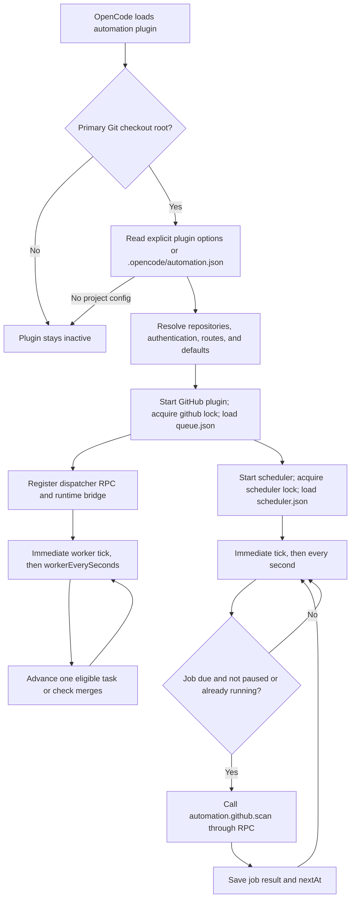
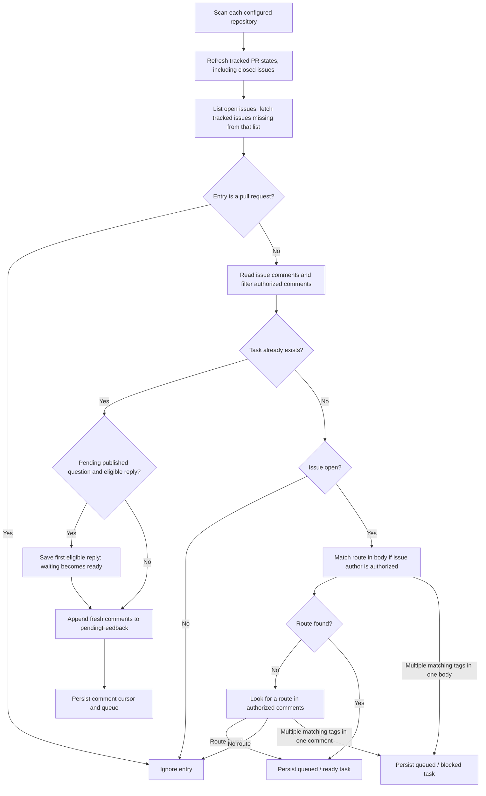
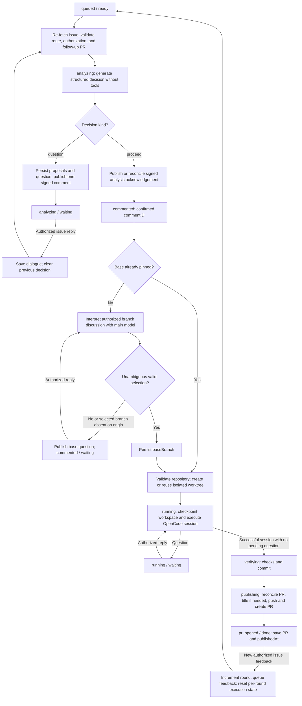
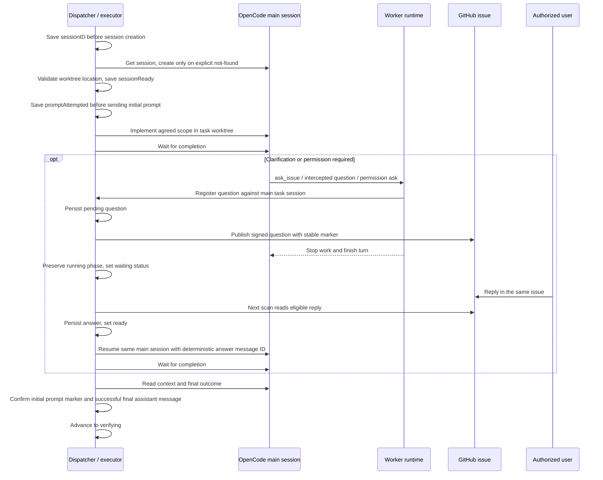
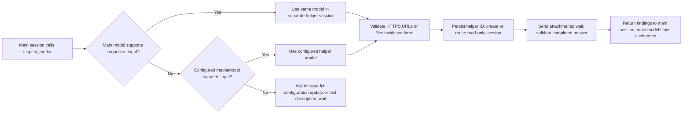
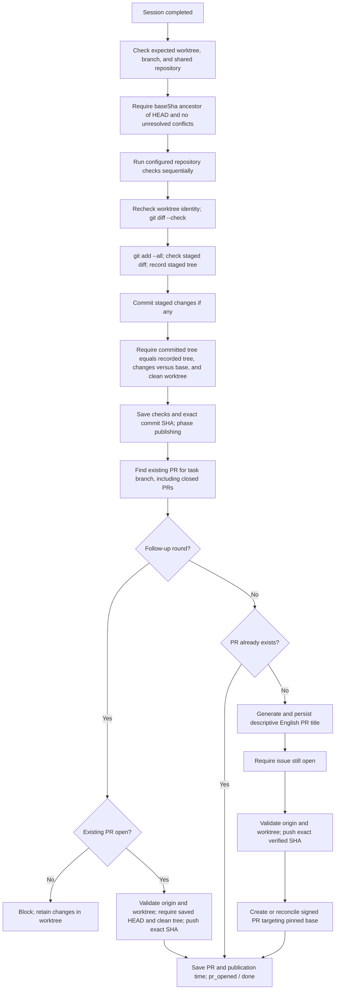
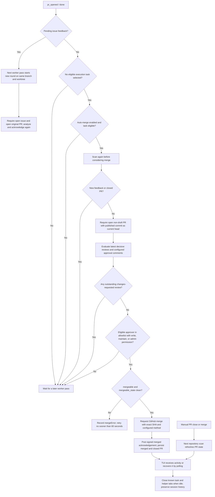
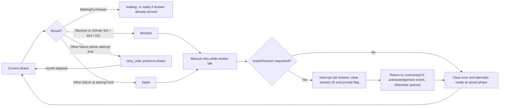

# Bot workflow: from GitHub issue to merged PR

This document describes the current implementation, including waiting, retries,
follow-up rounds, and recovery. Mermaid nodes use the actual persisted phase
and status names where applicable. `done` means publication finished; it does
not mean the PR has merged.

## 1. Startup, ownership, and polling

- Easy configuration puts state under the shared Git directory at
  `opencode2-automation/`. Worker worktrees do not start another scheduler.
- Default discovery interval: **60 seconds**. Default worker interval:
  **5 seconds**. These are separate loops: pausing scheduled scans does not
  cancel accepted work or active sessions.
- A scan cannot overlap another scan in the same dispatcher. Only one worker
  invocation runs at a time; one scheduler job cannot overlap itself.
- Each component renews one empty owner maintenance session at startup and every
  ten minutes. Durable session events refresh OpenCode's inactivity timer; listing
  plugins does not. No model is prompted. A PID check prevents touching a different
  service. Requests do not overlap and have a 15-second deadline. Pausing issue
  scans does not pause keepalive. Standalone servers without a matching registered
  service skip it.
- State is schema-validated and saved through a temporary file, file sync, and
  rename. A corrupt state file fails to load rather than resetting the queue.
  Local locks prevent duplicate owners sharing this state directory; independent
  machines do not share ownership.
- Shutdown clears timers and aborts local SDK waits even if the adapter ignores
  cancellation. It settles local writes, bounds RPC disposal to five seconds per
  component, and attempts all cleanup steps before releasing ownership. A replacement
  waits up to 15 seconds for locks without removing them. Healthy worktree sessions
  continue; the next owner reconciles the saved session before verifying and publishing.

Sources: [index.ts](../src/index.ts), [easy.ts](../src/easy.ts),
[GitHub plugin](../src/plugins/github.ts),
[scheduler plugin](../src/plugins/scheduler.ts), [state.ts](../src/state.ts).

## 2. Discovery and routing

Authorized comment filtering requires an author in the configured allowlist
(case-insensitive), a nonempty body, a non-`Bot` account type, and no
`<!-- opencode2:` marker. A human may use the same account as the bot: the login
itself is not excluded. Initial issue-body routing checks the issue author's
allowlist membership; the issue schema does not include an account-type check.

Routing tags are case-insensitive configured `@mentions`. If the issue body
selects a route, comments do not replace it. Otherwise the last matching
authorized comment encountered selects the route, unless matching throws for
multiple tags. An authorized comment can trigger work on another author's issue.

Each task is keyed by lowercase `owner/repository#issueNumber`. Its branch is
`automation/issue-N-DIGEST`, where `DIGEST` is the first 12 hex characters of the
SHA-256 of that key. Initial feedback contains the authorized comments already
seen. Later comments are tracked by increasing comment ID; edits do not create
new feedback. PR review comments do not drive implementation rounds.

Source: [dispatcher.ts — scanOnce](../src/dispatcher.ts),
[config.ts — matchRoute](../src/config.ts).

## 3. Main task lifecycle

Before `queued`, `analyzing`, or `commented` work advances, the dispatcher checks
that the issue is still open. Follow-ups additionally require an open original
PR and still-authorized feedback authors. A changed issue title, body, or route
after saved analysis blocks progress. Removing configuration or leaving no
unambiguous route also blocks work. These guards are phase-specific; closing an
issue does not immediately cancel an already-running session.

Analysis has no tools and does not inspect code. It returns validated JSON:
`proceed` with an English understanding and plan, or `question` with proposals
and a clarification. Invalid output retries. Requests for proposals or a choice
before implementation must wait for a reply, then run analysis again. An unclear
reply can generate another question. Persisted older analyses without a decision
are reassessed before implementation.

Base selection follows the acknowledgement. It considers authorized issue text,
comments, and clarification dialogues, excluding quoted lines and fenced code.
The model must substantiate an explicit branch using text from those inputs.
A selected branch, including the configured default, is checked on `origin`; ambiguity or absence
produces a question. Invalid model output or Git connection failure retries.
No preference uses the configured base, which easy configuration defaults to the
GitHub default branch. Fetch still has to succeed during preparation. Once saved,
the base stays pinned across retries and rounds; later comments do not rebase work.

Preparation validates the checkout root, `origin` repository, and branch name.
A new worktree is created from the fetched base commit under
`stateDirectory/worktrees/BRANCH-WITH-SLASHES-REPLACED-BY-DASHES`.
An existing worktree must have the expected real path, branch, and shared Git
directory. A branch already existing without its expected worktree blocks work.
The worker runtime is installed before execution.

Sources: [dispatcher.ts — workOnce, resolveAnalysis, resolveBase](../src/dispatcher.ts),
[executor.ts — analyze, selectBase, GitWorkspace.prepare](../src/executor.ts),
[branch.ts](../src/branch.ts).

## 4. Session execution and questions

- A saved `sessionID` is reused after transport failure. A network error when
  looking up a session never authorizes creating a duplicate. The initial prompt
  is sent only when `promptAttempted` is false.
- The implementation prompt instructs the agent to edit only its worktree and
  leave pushes, PR creation, comments, and branch changes to the dispatcher.
  These publication restrictions are prompt instructions; verification provides
  the subsequent Git consistency checks.
- Runtime context injects bundled bot instructions and optional project prompt
  instructions on each agent loop, including after compaction. A missing or empty
  configured prompt file fails execution.
- Within `running`, the bundled prompt guides project inspection, planning,
  use of available workflows and native subagents, implementation, verification,
  and final review. These are model instructions, not persisted dispatcher
  phases or enforced review gates. The executor's `verifying` phase remains
  separate. A prose blocker in the final summary does not set `blocked` status;
  user-input blockers must go through `ask_issue`.
- One unresolved question is retained at a time. Runtime hooks remove tools and
  reject non-question tool execution while a question is pending. Native subagent
  questions are attached to the main task; the reply resumes the main session.
- The first authorized comment after the published question is accepted without
  another mention. Other fresh comments remain feedback for a later round.
  Replies require the issue to be open. Question state survives restarts.
- Permission questions require the entire trimmed reply to be exactly
  `/allow QUESTION_ID` or `/deny QUESTION_ID`. The stored decision is scoped to
  the main session, action, and sorted resource set, including native workers.
  Until answered, the requested operation is denied. Explicit OpenCode deny
  rules are not overridden: the hook only handles permissions with effect `ask`.
- Replies to analysis questions rerun analysis; base replies rerun selection;
  implementation replies resume execution. Answer delivery is checkpointed and
  uses a deterministic message ID for retry reconciliation.
- A pending question prevents verification and PR publication. Waiting tasks
  release worker selection so other queued tasks can proceed.
- A timed-out wait interrupts the server session and blocks for inspection.
  Uncertain initial prompt delivery, a wrong session location, or a final outcome
  other than `succeeded` with a non-error assistant `finish: stop` also blocks.

Sources: [executor.ts — runSession](../src/executor.ts),
[runtime.ts](../src/runtime.ts), [prompt.ts](../src/prompt.ts),
[dispatcher.ts — question, publishQuestion](../src/dispatcher.ts).

## 5. Optional media inspection

Only the active main bot session can delegate media. Helpers have no tools.
URLs cannot contain credentials; local paths are resolved and must remain inside
the worktree. GitHub credentials are not forwarded to media URLs. A helper uses
stable session and prompt IDs for a given call. Helper failures return errors;
a helper timeout attempts interruption.

Source: [runtime.ts — inspect_media](../src/runtime.ts).

## 6. Verification and publication

The configured checks are command argument arrays. A failing configured check
produces `blocked`. With no configured checks, only Git consistency checks run;
the PR explicitly states that automated tests were not run. Commit hooks changing
the recorded tree, a dirty worktree after commit, or no diff from the base block
publication. Other command failures use the general error policy below.

The PR body contains the analysis, `Closes #N`, checks, session ID, and verified
commit SHA. Push uses `COMMIT:refs/heads/TASK_BRANCH` without force. The first
publication reconciles an existing branch PR by recording it without another
push; follow-ups require an open PR and push the new verified commit. Follow-ups
do not regenerate the existing PR title or body.

Signed comments use stable `opencode2` markers; reconciliation looks for a marker
posted by the authenticated account. This covers analysis acknowledgements,
questions, and merge acknowledgements after a lost response.

Sources: [executor.ts — GitWorkspace.verify, push, title](../src/executor.ts),
[dispatcher.ts — publishing](../src/dispatcher.ts),
[github.ts — ensureComment, ensurePull](../src/github.ts).

## 7. Feedback, merge approval, and tab closure

Merge eligibility requires `done`, a tracked nonclosed PR, a saved commit, no
merged flag, no pending feedback, and an elapsed `mergeNextAt`. Missing
`publishedAt` in an older queue starts a fresh approval window rather than using
historical approval. Merge checks run when the worker has no execution task to
advance, rather than immediately after every publication.

For each reviewer, the latest `APPROVED`, `CHANGES_REQUESTED`, or `DISMISSED`
review is decisive. Any outstanding changes request suppresses all approval
candidates, including comment approvals. An approval review must reference the
current verified SHA and have been submitted after `publishedAt`. An approval
comment must have been created after that time and match a configured phrase
as a whole message after case, whitespace, and trailing `.`/`!` normalization.
Bot comments and marked automation comments are excluded. Default phrases are
`/merge`, `lgtm, merge`, and `approved, merge`; default merge method is `squash`.
The permission check then requires an allowlisted candidate with repository write,
maintain, or admin access. GitHub still enforces merge requirements.

Every successful round updates `publishedAt`, so old approvals cannot authorize
the next published round. A false merge result schedules another check after
60 seconds; errors also respect GitHub retry timing. An already-merged response
can reconcile a previously lost merge response.

Follow-up rounds reset analysis, question, current session, checks, and commit;
they retain the branch, worktree, pinned base, and previous session reference.
They create a new main session, whereas an implementation-question reply resumes
the current one. Comments received while working stay queued for a later round.
Feedback after closure can still be queued, but the next round's guards block it.

PR-state scanning is independent of auto-merge and issue openness. The TUI
subscribes to activity and polls every 10 seconds, including recovery on startup.
It opens background task tabs when enabled and exposes `/bot` for session access.
Closure cleanup includes known earlier-round sessions and media helpers. Busy
tabs wait until idle; cleanup does not delete sessions, interrupt work, or remove
worktrees. A manually reopened tab is not repeatedly closed in the same TUI instance.

Sources: [dispatcher.ts — workOnce, mergeOnce, scanOnce](../src/dispatcher.ts),
[approval.ts](../src/approval.ts), [github.ts — mergeApproved](../src/github.ts),
[ui.ts](../src/ui.ts), [activity.ts](../src/activity.ts).

## 8. Status, retries, and recovery

Phase records **where** execution stopped. Status records **whether** it may run.
An error normally preserves the phase so retry continues from its checkpoint.

| Status | Meaning and next action |
| --- | --- |
| `ready` | Eligible for worker selection when due. |
| `waiting` | Awaiting an issue answer; no implementation or publication while unresolved. |
| `retry_wait` | Transient failure; automatic retry after `nextAt`. |
| `blocked` | Explicit `Blocked` error or GitHub HTTP 401, 404, or 422; requires inspection and manual retry. |
| `failed` | Other errors reached `maxAttempts`; manual retry required. |
| `done` | PR publication/reconciliation completed; feedback and merge monitoring remain possible. |

- Task backoff is `min(3600, 5 * 2^attempts)` seconds, with the incremented
  attempt count: the first retry is after 10 seconds. GitHub retry headers can
  extend it. Default maximum attempts: 5. Successful phase transitions reset
  attempts, so the limit is not a lifetime cap across all phases.
- Scheduler failures use a separate backoff: 5, 10, 20 seconds, and so on, capped
  at one hour. Successful scans return to the configured scan interval.
- A resumable `running` task with a saved session takes priority over other work.
  If its retry time is still in the future, the worker waits rather than starting
  another issue that could overlap an unreconciled session.
- A waiting question whose POST response was lost is republished/reconciled by
  its marker. Failures in that recovery path retry after 60 seconds.
- `retry` accepts only blocked or failed tasks and is rejected while the worker
  or maintenance is busy. `restartSession` does not delete the worktree or changes;
  it restarts session execution from the appropriate earlier phase.
- Merge errors use `mergeError` and `mergeNextAt`; they do not turn a published
  task into an implementation failure.
- Reloading the owner project after restart restores polling from durable state.
  Activity events are notifications, not the durable queue.

Sources: [dispatcher.ts — workOnce, retryOnce](../src/dispatcher.ts),
[scheduler.ts](../src/scheduler.ts), [state.ts](../src/state.ts).
