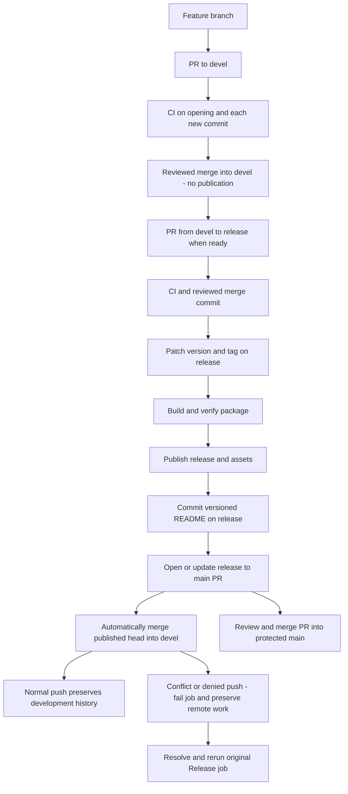

# Release process

`devel` collects feature changes. `release` is the persistent publication branch.
`main` receives
completed releases through PR merges only. Never push a commit directly to `main`,
modify its files with the Contents API, or bypass its protection rules.

## Events and responsibilities

| Event | Result |
| --- | --- |
| Commit/push on a feature branch without an open PR | No CI run and no package build. |
| Open, reopen, or update a PR targeting `devel` or `release` | Full CI on Node 22 and 24, including native TUI rendering with the pinned Bun test dependency, build and isolated package installation. |
| Merge a feature PR into `devel` | Accumulate changes without publication. |
| Merge a same-repository `devel` → `release` PR | Automatic patch version, tag, publication, README commit on `release`, main promotion PR, and automatic merge back into `devel`. |
| Close a PR without merging | No publication. |
| Push a version tag pointing to code on `release` | Publish that exact version, without an automatic bump. |
| Push a version/README commit without a tag | No publication; automation cannot trigger itself in a loop. |
| Open/update the PR from `release` into `main` | `Release ready` validates publication and README without rebuilding the package. |
| Merge the promotion PR into `main` | Update `main` only; no new release or package build. |
| Automatic synchronization push into `devel` | No release, package build, or synchronization PR. |

## Automatic patch release

1. Create the feature branch from current `devel`. Add accurate bullet points
   under `## Unreleased` in `CHANGELOG.md`; do not pre-bump the package version.
2. Open a PR into `devel`. Its current revision must pass `Checks (Node 22)` and
   `Checks (Node 24)` before review and merge. Every new commit reruns these checks.
   Accumulate as many feature PRs as needed; none of these merges publishes a release.
3. When ready for a release, open a same-repository `devel` → `release` PR. Its
   current revision must pass the same checks, including manifest consistency and
   nonempty `Unreleased` notes. Review it and use **Create a merge commit**.
   CI rejects other source branches targeting `release`; the publisher also
   validates the source independently. Keep both long-lived branches.
4. The merged-PR workflow increments the patch version, updates both manifests,
   moves `Unreleased` into the exact new version section, and records the PR,
   merge SHA and version in `.github/release-state.json` for retries.
5. It commits these files on `release`, creates an annotated `vVERSION` tag, and
   pushes the branch and tag atomically. An existing tag is never moved.
6. In the same run, it checks out the tag, builds and verifies the package and
   checksum, then uploads both assets to a draft GitHub Release before publishing
   it with exact changelog notes. No second tag-triggered workflow is required.
7. After GitHub confirms stable publication and uploaded assets, it commits the
   versioned README block on `release` and opens or updates `release` → `main`.
   Publication failure never advances README or creates the promotion PR.
8. The same job automatically merges that published release head into current
   `devel` and pushes normally, without a PR. This brings back version metadata,
   changelog, release state and README. It does not wait for the main PR to merge.
9. Review the main promotion and use **Create a merge commit**. Keep `release`.



## Automatic synchronization into devel

The publisher fetches current `devel` and merges the exact published release head
in a temporary worktree. If `devel` has no new work it fast-forwards; otherwise it
creates a normal merge commit. It never resets `devel`, cherry-picks selected files,
force-pushes, creates a synchronization PR, or pushes to `main`. A completed sync
is detected by ancestry and becomes a no-op on retry.

If development advances during the push, the publisher fetches the new tip and
retries the merge, up to three attempts. Conflicts stop synchronization without
changing remote `devel`; the publication and main PR remain available. Resolve
conflicts on `devel` while preserving its history, then rerun the original Release
job. Permission/protection failures also fail visibly; the publisher does not
bypass branch rules. A later retry reuses the published version and assets.

New changes to `CHANGELOG.md`, manifests or the README download block can conflict
with release metadata. Such conflicts require a maintainer's decision; automation
does not silently choose one side. Avoid parallel edits to release metadata while
publishing. Other feature work can continue on `devel` throughout publication.

The automatic push uses `GITHUB_TOKEN` and creates no PR. There is no push-to-devel
CI trigger and no publication trigger for devel merges, so this cannot start a
release loop. After sync, GitHub may require updating an already-open
`devel` → `release` PR or approval of its workflow run before fresh checks appear.

## Manual version release

Use this path for a specific version such as `1.0.0`, including minor/major bumps.
Finish any running publication first, then update local `release`:

```bash
git switch release
git pull --ff-only origin release
```

Move the relevant unreleased notes into an exact `## 1.0.0` section and commit them.
Then create and push the version commit and tag:

```bash
git add CHANGELOG.md
git commit -m "Document release 1.0.0"
npm version 1.0.0
git push --atomic origin release v1.0.0
```

The tag workflow publishes `1.0.0` without bumping it again. Unprefixed tags such
as `1.0.0` are also accepted if created manually. The tag version must exactly
match `package.json` and both root versions in `package-lock.json`. A new release
must be newer than GitHub's latest stable release. The next automatic patch after
manual `1.0.0` is `1.0.1`.

A manual prerelease such as `1.1.0-beta.1` is published as a prerelease; it does
not replace the stable README link, open a promotion PR, or synchronize `devel`. It must also originate
on `release` and have its own exact changelog section.

## README and protected main

The version tag identifies the package source. The later README commit is on
`release` and enters `main` with the same promotion PR as all released code.
Consequently, the README inside the tag/archive remains a build-time snapshot.
While the PR awaits review, `main` can still show the previous stable download;
the README on `release` contains the newly published one.

The `Release ready` check requires a same-repository `release` → `main` PR. It
verifies that the PR version is published with the expected assets, that its code
matches the tag (only README may differ), and that README contains the new links.
This also prevents a pending promotion from silently accepting new, unpublished
feature commits added to `release`. It does not build another package or check
whether a tag belongs to `main`.

## Repository setup

- Keep `devel`, `release` and `main` as long-lived branches. Create `devel` from
  current `release` when migrating. Retarget pending feature PRs to `devel`.
  Include the migration workflow changes in pending feature branches so their PR
  revisions use the new CI configuration. Merging these into `devel` is safe and
  does not publish a package.
  The first reviewed `devel` → `release` merge activates the new publication flow.
- Protect `main`: require a PR, review of the current revision, and the
  `Release ready` status check. Apply protection to administrators as well;
  disable force pushes and deletion. Automation needs no bypass permission.
- The publisher needs `contents: write` for commits/tags on `release`, automatic merges
  into `devel`, and release assets, and `pull-requests: write` to create/update its promotion PR. If `release`
  has additional protection, it must permit the publisher's version and README
  commits. Feature changes enter `devel` through reviewed, passing PRs.
- `devel` rules must allow the publisher's normal synchronization push. If all
  direct writes require PRs with no publisher exception, no-PR synchronization
  is impossible; configure an allowed automation identity. This exception applies
  only to `devel` (and release metadata on `release`), never to `main`.
- In **Settings → Actions → General → Workflow permissions**, enable
  **Allow GitHub Actions to create and approve pull requests**. The workflow only
  creates/updates the main PR; it never approves or merges that PR. Its direct
  release-to-devel Git merge is a separate authorized operation. Keep default token
  permissions read-only; the publisher grants only its required permissions.
- GitHub may require **Approve workflows to run** on a PR created/updated with
  `GITHUB_TOKEN`. A maintainer approves those runs before review/merge. Do not
  disable the required promotion check to avoid that approval.
- Keep merge commits enabled and preserve `devel` and `release`. Avoid squash or
  rebase merges for `devel` → `release` and `release` → `main`: shared ancestry is
  needed for clean future promotions and automatic back-merges.

## Concurrency and recovery

Merge one `devel` → `release` PR at a time and wait for publication, README,
main PR and devel synchronization to finish before another release merge or
manual version bump. Feature merges into `devel` do not need to wait. Automatic and manual runs
share a concurrency group and never cancel a running publication. GitHub retains
only one pending run per group; several overlapping triggers can replace pending
runs. Do not use the concurrency queue as a release backlog.

The script requires the merged PR to still be the release tip when starting a new
patch. On retry it recognizes the committed PR/version record. Manual tags and
resumed runs must still match the code on `release`, allowing only a subsequent
README change. A concurrent branch change stops the run rather than overwriting
commits, including untagged code in a package, or moving an existing tag.

Use **Re-run all jobs** on the original failed Release run:

- Before the version/tag push: no remote version was created; the retry prepares it.
- After the atomic push: reuse the recorded version/tag; never bump a second time.
- During packaging/upload: rebuild from the same tag and repair assets only while
  the GitHub Release is still a draft.
- After publication: verify and reuse the published assets without overwriting or
  rebuilding them, then finish README, main PR and devel synchronization.
- After the README commit or a lost PR response: reuse that commit and discover the
  existing open promotion PR before creating another one.
- After a devel synchronization failure: resolve the conflict or write permission,
  then retry. A completed merge is detected and not duplicated.

If a newer release merge or manual version has already advanced `release`, an old
run may refuse to resume. Inspect the current branch and latest release before
continuing; do not reset `release` or force-move tags to make an old run succeed.
Any unresolved changes remain in Git. Draft releases are not complete publications.
If abandoning a failed, tagged version in favor of a later one, include its still
unpublished changes in the later version's changelog notes as part of the repair PR.
